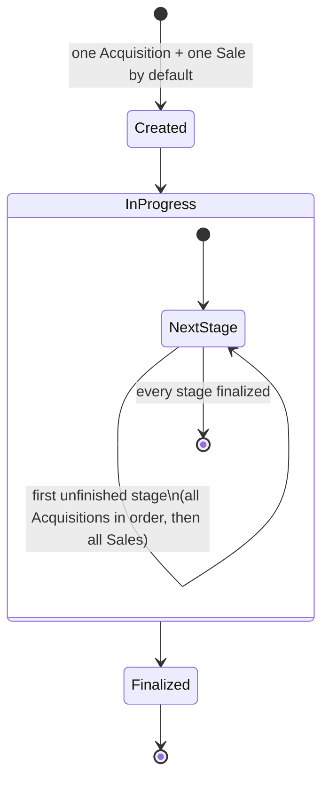
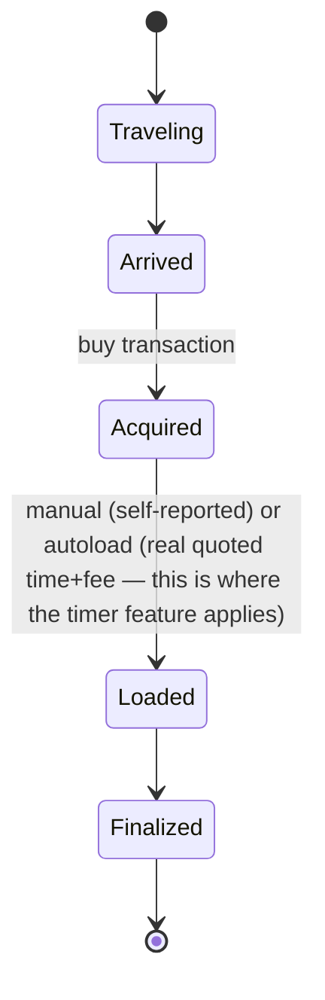
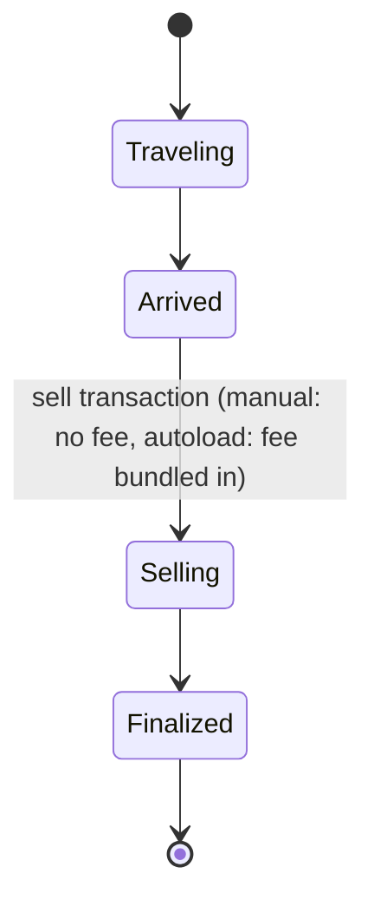

# Trade route tracker — design & plan

**Status:** design settled, not yet implemented. Supersedes the earlier generic
`pilot_preference` memory system, which is fully shelved (see below).

## Why this instead of generic pilot-preference memory

The original memory-system design (Lyra-adapted classifications — correction,
behavioral_instruction, pilot_preference, incidental_detail, episodic_event —
dual-write Postgres+Chroma) was built and verified working, then deliberately
reverted. It had no concrete "reason to need memory" — it optimized suggestions
but didn't feel like the AI knowing the pilot specifically. That work lives on
the `pilot-preference-memory` branch, fully shelved, not currently planned to
be revisited. If it ever is, route tracking is meant to be the *foundation* it
builds on, not a detour from it — see the branch and this doc's history for
context.

Trade route tracking replaced it: buildable today with existing tooling
(commodity/vehicle lookups already integrated), and it structurally sets up
the retrieval infrastructure (location/route-keyed records) that richer
memory would need later anyway.

**Reference point:** [ArkanisOverlay](https://github.com/ArkanisCorporation/ArkanisOverlay)
(C#/.NET, WPF+Blazor+ASP.NET Core, UEX data partnership). Not a dependency —
studied for its `TradeRun` domain model, then deliberately adopted close to
as-is after a long back-and-forth about whether to diverge from it (see
"Workflow decisions" below). Their own app fixed an autoload cost-ordering bug
in a recent update, which is reflected here.

## Workflow decisions

Landed, after extensive iteration, on **wholesale adopting Arkanis's actual
state model** rather than a hand-modified variant. Two custom simplifications
were tried and explicitly rejected in favor of matching Arkanis:
- A "same shape for buy and sell, order-independent" simplification — rejected,
  went back to Arkanis's actual (asymmetric) buy/sell shapes.
- An explicit pause/redirect branch for "can't sell here" — not in Arkanis,
  and dropped for this pass. Revisit as an additive layer later, same as stop
  ordering (below).

### Run level



`Acquisitions` and `Sales` are separate, unordered collections — no explicit
link between a specific acquisition and a specific sale, no stop-order field.
Reconciliation is by commodity quantity only (how much acquired vs. sold, per
commodity). This is intentional and already supports the multi-commodity case
("buy A at station 1, buy B at station 2, sell both at station 3") without
extra design — it's just more legs in the same flat collections.

**Explicitly deferred, additive-later:** stop ordering (an optional
`sequence_number` per leg), pause/redirect on a failed sale.

### Acquisition (buy) leg

One fixed order — no branch by transfer method. Autoload's fee is just a data
field on the leg (`cargo_transfer_fee`), not a different state path:



### Sale (sell) leg

**Revised (2026-07-19):** originally designed as branching by transfer method
(manual unloads before selling, autoload sells before the transfer catches
up) — implementation surfaced that this branch was never a real state-path
distinction once there's no separate time cost for unloading (see below), so
it collapsed to one path. The Sell dialog captures quantity/price/transfer
type/fee and stamps the sale *and* the transfer together in one action; the
toggle only changes whether a fee field appears, not which states exist:



**Confirmed with the user (2026-07-14):** unloading has no meaningful time
cost in-game, unlike loading — only a fee matters for the final report. So the
timer feature applies to the *buy* side only, not sell. This is the actual
origin scenario for the timer feature (AutoLoad hauler wait), now with a real
home instead of being a standalone dumb timer. This is also *why* the branch
above collapsed — with no time cost either way, there was never a real
second state to reach, just a fee to record.

## Implementation principles (not schema, but must not be skipped)

1. **Whatever asks the pilot for info drives off "what's the next unset
   milestone," not a fixed field/question order.** This is what actually
   prevents Arkanis's original backward-data-entry bug for autoload — not a
   diagram change, an implementation discipline. Don't hardcode a form
   sequence that only matches one transfer method.
2. **Multi-leg disambiguation uses the same pattern already proven elsewhere
   in this codebase** (e.g. `commodity_price_lookup`'s fuzzy-match-miss
   message) — a tool call that can't unambiguously resolve which leg an
   utterance refers to returns a clear list of candidates instead of
   guessing; the LLM relays it as a clarifying question. No bespoke intent
   parser needed. If a pilot's report is unambiguous (only one matching
   pending leg, or they named the terminal/commodity), no friction at all.
3. **Post-sale market observation (for UEX / a local supplementary cache) is
   explicitly deferred** — add after the core loop works, not blocking this.
   Ties to the pseudo-datarunner idea already logged in memory.

## Build plan

1. **Schema** — Postgres via async SQLAlchemy + Alembic. Infrastructure
   (docker-compose, session setup, migration wiring) already exists, proven
   working, on the parked `pilot-preference-memory` branch — reusable as-is,
   only the actual tables change (`Route`/leg tables replace `PilotMemory`).
   No ChromaDB needed for this feature — everything here is structured/
   relational, not semantic retrieval.
2. **Manual UI first, AI second, deliberately sequenced this way.** Build the
   overlay so the pilot can run the whole workflow by hand — familiar,
   Arkanis-like — get that working and tested before any LLM writes to the
   same state. AI/voice integration is then just a second way of writing to
   the same shared schema (input source tagged as metadata), added once the
   manual path is proven, not built in parallel with it.
3. **AI/voice integration** — ordinary tools (`mark_cargo_acquired`,
   `mark_cargo_loaded`, `mark_cargo_sold`, etc.) following the existing
   `UplinkTool` pattern, not a separate extraction/recall graph. Multiple
   tool calls from one utterance (compound "loaded it, what's the ETA
   again?") are already handled by ordinary `bind_tools` behavior — no new
   graph architecture needed, unlike what the earlier memory-system plan
   assumed. The **Trade Advisor** (scoring/recommendation, see below) is the
   substantial piece of this step — not just tools that log what already
   happened, but ranking what to do next.

## Trade Advisor — scoring & inferred preferences (AI integration phase)

**This is the "AI aspect" of the feature, built once the ledger and manual UI
are working — not part of the schema or manual-UI phases.** It's a
recommendation/scoring layer that reads the ledger (once it has real data)
plus live UEX data; it doesn't change the core run/leg schema. Design capture
now, implementation later, per the Build plan above.

### Scoring

Rank candidate trades by **profit per hour**, not margin or profit alone —
margin and distance are inputs to the metric, not separate filters applied
in sequence:

```
total_time = load_time + travel_time + unload_time
score = profit / total_time
```

- `load_time` / `unload_time` — personal ledger benchmarks, keyed by
  ship+cargo+method (auto vs. manual). This resolves the earlier open
  question about benchmark granularity — ship+cargo is the key, not
  origin-destination.
- `travel_time` — computed from Gm distance + ship speed/quantum travel, not
  from the ledger (it's a physics calculation, not a judgment call).
- Gm radius and autoload-required are **query-time filters on the candidate
  pool**, not stored preferences — narrow the pool first, then rank by score
  within it.

### SCU-shortfall handling

When a station can't fill the hold, score all three options and take the
max — don't default to any one:

1. **Multi-commodity, same stop** — fill the remainder with a second
   commodity from the same station, same/nearby destination. No added
   travel time, just an extra load pass.
2. **Second pickup stop** — detour to a nearby station to top off. Only
   worth it if the added profit from the extra SCU exceeds the added time
   cost of the detour (recompute score including the detour leg).
3. **Partial fill, go anyway** — the baseline. Sometimes correctly wins if
   nearby options are weak.

Cap detour search to **one additional stop** within the existing Gm radius —
avoid open-ended multi-hop pathfinding; that's a harder problem to defer,
not solve here.

Architecturally, this operates on *candidate* routes, not committed ones —
the same `GameTradeRoute` (suggestion) vs. `TradeRun` (committed) split
already adopted from Arkanis. The Advisor scores hypothetical legs (including
a not-yet-committed detour); only a pilot's actual commitment creates ledger
rows via the tools in the Build plan's AI-integration step.

### What gets stored vs. computed live

**The test:** does deriving it require *interpreting behavior* (a judgment
call), or just *counting it* (an aggregate query)? Only the former gets
stored — the latter is a live ledger/UEX query at ask-time, so it can't go
stale.

**Inferred preferences (interpretation required — store these):**
- `risk_tolerance{trade_risk, mining_risk}` — derived by weighing route
  danger against margin historically accepted.
- `trade_preference{profit, margin}` — derived by comparing chosen routes
  against alternatives *available at the time* (did they pick
  lower-volume/higher-margin over higher-volume/lower-margin, when both were
  options?).
- `mining_goal{quantity, quality, profit}` — same idea, scoped to mining.
  Deferred until a mining ledger exists.

**Query-time parameters (NOT stored — computed live):**
- System/region of operation — `GROUP BY` on the ledger.
- Loading method tendency (% auto vs. manual) — live aggregate over recent
  loads.
- Terminal type tendency (orbit vs. ground) — same pattern. Already free:
  `CachedTerminal.type` already exists in the UEX reference cache
  (`app/tools/uexcorp/reference_cache.py`) — a leg only needs to reference
  the terminal, type comes via join, nothing new to capture.
- Ship class tendency — most-used hauler(s) from the ledger.
- Gm radius, autoload-required — supplied per-query (by pilot or agent
  context), not a standing preference.

**Still open / not yet scoped** (real, but not designed):
- `legality_tolerance{legal_only, gray_market, contraband}` — a real SC
  mechanic, distinct from general trade risk.
- `cargo_fill_preference{max, buffer}` — full-capacity vs. safety-margin
  loading habit.
- `escort_preference{solo, group}` — changes what "safe route" even means.
- `session_time_budget{short_loop, long_haul}` — affects what the advisor
  should even suggest.
- `commodity_affinity` — loyalty to specific goods vs. pure profit-chasing;
  likely inferred from ledger pattern, not set directly.

### Schema note for stored fields

Every stored (inferred) field carries `confidence`, `sample_size`, and
`last_updated`, and uses a three-tier surfacing rule: **high confidence →
act silently; low confidence or a contradicting pattern → surface and let
the pilot confirm/correct.**

## Tech stack for the overlay UI

**PySide6** (Qt for Python), chosen over PyQt6 specifically for licensing —
PySide6 is LGPL (Qt Company-maintained), PyQt6 is GPL/commercial. For a
project that may eventually be shared or is portfolio-visible, LGPL is the
safer default. Chosen over tkinter for layout/maintainability (QLayout,
QSS styling vs. tkinter's pack/grid) — see below for why that choice no
longer trades anything away.

**UI is toggle-open/closed on a hotkey (e.g. F3, matching Arkanis), not a
persistent always-visible HUD.** This was clarified after initially assuming
the overlay needed to render *over* active gameplay simultaneously — it
doesn't. While the UI is open, the pilot is interacting with it, not the
game, so **click-through to Star Citizen underneath is not a requirement at
all.** That eliminates the entire earlier concern about needing native win32
layered-window integration (`WS_EX_LAYERED`/`WS_EX_TRANSPARENT`) — a normal
always-on-top window that shows/hides is sufficient in any GUI framework,
Qt included. The toggle hotkey itself reuses the exact global-hotkey pattern
already proven in `voice_input.py` (`pynput.keyboard.Listener`), just bound
to show/hide instead of starting a recording — not new research.

**Still a real, open question:** the threading model. A GUI toolkit's event
loop typically wants the main thread (this was true of the old tkinter
overlay, and is generally true of Qt too) — meaning voice.py's current
single-threaded loop will need restructuring: Qt's event loop on the main
thread, voice loop on a worker thread, communicating through a thread-safe
queue (same shape as the old overlay's `push()` pattern, just carrying route
state instead of RS detections). Not yet verified for Qt specifically.
