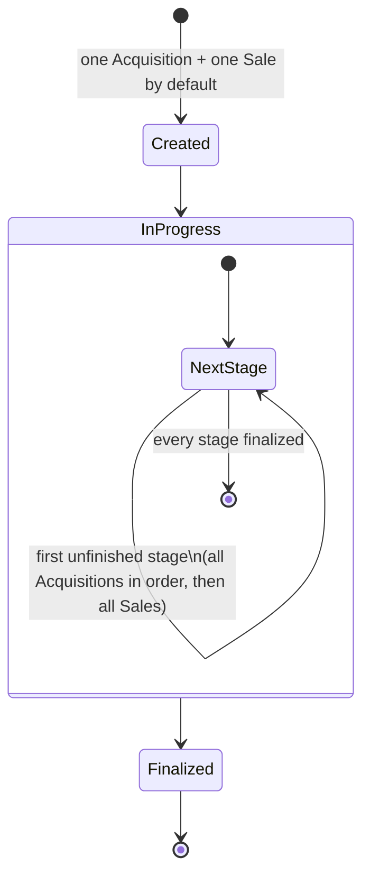
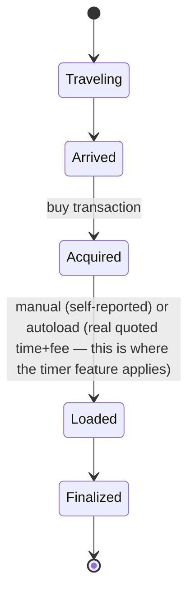
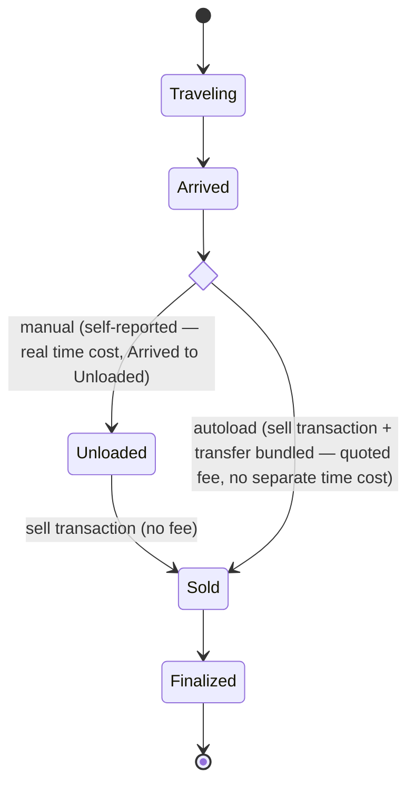

# Trade route tracker — design & plan

**Status:** design settled, not yet implemented. Supersedes the earlier generic
`pilot_preference` memory system, which is fully shelved (see below).

## Why this instead of generic pilot-preference memory

The original memory-system design (Lyra-adapted classifications — correction,
behavioral_instruction, pilot_preference, incidental_detail, episodic_event —
dual-write Postgres+Chroma) was built and verified working, then deliberately
reverted. It had no concrete "reason to need memory" — it optimized suggestions
but didn't feel like the AI knowing the pilot specifically. That work lives on
the `pilot-preference-memory` branch, fully shelved, not currently planned to
be revisited. If it ever is, route tracking is meant to be the *foundation* it
builds on, not a detour from it — see the branch and this doc's history for
context.

Trade route tracking replaced it: buildable today with existing tooling
(commodity/vehicle lookups already integrated), and it structurally sets up
the retrieval infrastructure (location/route-keyed records) that richer
memory would need later anyway.

**Reference point:** [ArkanisOverlay](https://github.com/ArkanisCorporation/ArkanisOverlay)
(C#/.NET, WPF+Blazor+ASP.NET Core, UEX data partnership). Not a dependency —
studied for its `TradeRun` domain model, then deliberately adopted close to
as-is after a long back-and-forth about whether to diverge from it (see
"Workflow decisions" below). Their own app fixed an autoload cost-ordering bug
in a recent update, which is reflected here.

## Workflow decisions

Landed, after extensive iteration, on **wholesale adopting Arkanis's actual
state model** rather than a hand-modified variant. Two custom simplifications
were tried and explicitly rejected in favor of matching Arkanis:
- A "same shape for buy and sell, order-independent" simplification — rejected,
  went back to Arkanis's actual (asymmetric) buy/sell shapes.
- An explicit pause/redirect branch for "can't sell here" — not in Arkanis,
  and dropped for this pass. Revisit as an additive layer later, same as stop
  ordering (below).

### Run level


```mermaid
stateDiagram-v2
    [*] --> Created: one Acquisition + one Sale by default
    Created --> InProgress

    state InProgress {
        [*] --> NextStage
        NextStage --> NextStage: first unfinished stage\n(all Acquisitions in order, then all Sales)
        NextStage --> [*]: every stage finalized
    }

    InProgress --> Finalized
    Finalized --> [*]
```

`Acquisitions` and `Sales` are separate, unordered collections — no explicit
link between a specific acquisition and a specific sale, no stop-order field.
Reconciliation is by commodity quantity only (how much acquired vs. sold, per
commodity). This is intentional and already supports the multi-commodity case
("buy A at station 1, buy B at station 2, sell both at station 3") without
extra design — it's just more legs in the same flat collections.

**Explicitly deferred, additive-later:** stop ordering (an optional
`sequence_number` per leg), pause/redirect on a failed sale.

### Acquisition (buy) leg

One fixed order — no branch by transfer method. Autoload's fee is just a data
field on the leg (`cargo_transfer_fee`), not a different state path:


```mermaid
stateDiagram-v2
    [*] --> Traveling
    Traveling --> Arrived
    Arrived --> Acquired: buy transaction
    Acquired --> Loaded: manual (self-reported) or autoload (real quoted time+fee — this is where the timer feature applies)
    Loaded --> Finalized
    Finalized --> [*]
```

### Sale (sell) leg

**Revised again (2026-07-20):** the 2026-07-19 collapse below was wrong — it
assumed unloading never has a real time cost, generalizing from autoload
alone. Manual unload genuinely does: the pilot has to physically move cargo
out before the kiosk will register the sale, the same real-world-time
category as Acquisition's Loaded step. Autoload still has no separate time
cost (transfer completes instantly, quoted fee only), so it keeps the
collapsed path. Two branches by transfer method, not one:


```mermaid
stateDiagram-v2
    [*] --> Traveling
    Traveling --> Arrived

    state transfer_type <<choice>>
    Arrived --> transfer_type

    transfer_type --> Unloaded: manual (self-reported — real time cost, Arrived to Unloaded)
    Unloaded --> Sold: sell transaction (no fee)

    transfer_type --> Sold: autoload (sell transaction + transfer bundled — quoted fee, no separate time cost)

    Sold --> Finalized
    Finalized --> [*]
```

**Confirmed with the user (2026-07-14):** unloading has no meaningful time
cost for autoload — only a fee matters for the final report there. The timer
feature (AutoLoad hauler wait) applies to Acquisition's Loaded step and
Sale's manual Unloaded step; autoload's sale-side transfer stays a pure fee,
no timer. `transferred_at - reached_at` on a manual sale leg is real,
queryable unload-duration data (`app/db/trade_run_store.py`'s
`_SALE_MANUAL_SEQUENCE`/`_SALE_AUTOLOAD_SEQUENCE`) — useful later for the
Trade Advisor's `load_time`/`unload_time` benchmarks (see below), e.g.
suggesting autoload pickup + manual unload to minimize total run time when
that combination scores higher.

## Implementation principles (not schema, but must not be skipped)

1. **Whatever asks the pilot for info drives off "what's the next unset
   milestone," not a fixed field/question order.** This is what actually
   prevents Arkanis's original backward-data-entry bug for autoload — not a
   diagram change, an implementation discipline. Don't hardcode a form
   sequence that only matches one transfer method.
2. **Multi-leg disambiguation uses the same pattern already proven elsewhere
   in this codebase** (e.g. `commodity_price_lookup`'s fuzzy-match-miss
   message) — a tool call that can't unambiguously resolve which leg an
   utterance refers to returns a clear list of candidates instead of
   guessing; the LLM relays it as a clarifying question. No bespoke intent
   parser needed. If a pilot's report is unambiguous (only one matching
   pending leg, or they named the terminal/commodity), no friction at all.
3. **Post-sale market observation (for UEX / a local supplementary cache) is
   explicitly deferred** — add after the core loop works, not blocking this.
   Ties to the pseudo-datarunner idea already logged in memory.

## Architecture: a workflow without graph nodes

**The trade run *is* an AI workflow — buy → load → travel → sell → finalize — deliberately
implemented as a state machine + guarded tools, not as LangGraph nodes/edges.** Worth
naming explicitly (2026-09-11), since "should this be a LangGraph workflow" is a natural
question to re-ask as the feature grows, and the answer holds for concrete reasons, not
just because CLAUDE.md says so:

1. **The steps span real gameplay time, not conversation turns.** A leg takes minutes to
   hours, with unrelated turns in between (a price lookup, a timer). LangGraph's checkpoint
   resets to `classify_topic → respond` every turn — there's no natural place for the graph
   to sit "paused" mid-workflow-node across all that.
2. **Multiple concurrent, interleavable runs.** A pilot can have two active runs and jump
   between them by what they say. `resolver.py`'s fuzzy matching + disambiguation-by-asking
   handles "which of several workflows does this mean" far more naturally than a single
   graph would.
3. **Compound utterances.** "Landed at Orison and unloaded the cargo" advances two
   milestones from one utterance — ordinary `bind_tools` fan-out handles this for free; a
   graph-node workflow would need explicit multi-edge handling for the same thing.
4. **Soft constraints, not hard edges** (see `docs/ledger-trust-and-corrections.md`) — a
   tool that says "I don't have a record of X, force it anyway?" is a conversation, not a
   routing decision. Graph edges are naturally binary; a tool return value can hedge.

**The four layers that make it a workflow anyway:**
1. **State machine as data, not code-path** — `TradeRun` → `TradeLeg`, each with a
   milestone sequence (`LegMilestone`, `_ACQUISITION_SEQUENCE` / `_SALE_*_SEQUENCE` in
   `trade_run_store.py`). `next_unset_field()` computes "what's next" from pure data — this
   *is* the workflow definition (Implementation principle 1, above).
2. **One tool per valid transition, guarded** — `mark_arrived` → `REACHED_AT`,
   `record_purchase`/`mark_cargo_acquired` → `TRANSACTION_COMPLETED_AT`, `start_trade_run`
   (designed, not built — `docs/start-route-tool.md`) → creates the run. Each tool checks
   `next_unset_field` and refuses (soon: soft-constrains) an out-of-order attempt.
3. **Resolution instead of routing** — Implementation principle 2, above: a tool that can't
   unambiguously resolve which leg/run an utterance means asks, rather than a graph deciding
   which node to enter.
4. **The graph is stateless with respect to the workflow.** The checkpointer holds chat
   history for coreference ("it," "that leg"), never workflow position. Postgres is the only
   source of truth; the graph's job each turn is just "pick the right tool."

A fifth layer, designed not built: the **presence layer** (`docs/presence-layer.md`) is a
*view* onto layer 1 — it renders `next_unset_field`/`current_step_title` and never becomes a
second source of truth.

The one place graph nodes would be the right tool: if the parked SC-vs-general router ever
needs to *restrict which tools the model can see* per turn. That's a domain-routing concern,
already scoped separately — not trade-run workflow modeling.

## Build plan

1. **Schema** — Postgres via async SQLAlchemy + Alembic. Infrastructure
   (docker-compose, session setup, migration wiring) already exists, proven
   working, on the parked `pilot-preference-memory` branch — reusable as-is,
   only the actual tables change (`Route`/leg tables replace `PilotMemory`).
   No ChromaDB needed for this feature — everything here is structured/
   relational, not semantic retrieval.
2. **Manual UI first, AI second, deliberately sequenced this way.** Build the
   overlay so the pilot can run the whole workflow by hand — familiar,
   Arkanis-like — get that working and tested before any LLM writes to the
   same state. AI/voice integration is then just a second way of writing to
   the same shared schema (input source tagged as metadata), added once the
   manual path is proven, not built in parallel with it.
3. **AI/voice integration** — ordinary tools (`mark_cargo_acquired`,
   `mark_cargo_loaded`, `mark_cargo_sold`, etc.) following the existing
   `UplinkTool` pattern, not a separate extraction/recall graph. Multiple
   tool calls from one utterance (compound "loaded it, what's the ETA
   again?") are already handled by ordinary `bind_tools` behavior — no new
   graph architecture needed, unlike what the earlier memory-system plan
   assumed. The **Trade Advisor** (scoring/recommendation, see below) is the
   substantial piece of this step — not just tools that log what already
   happened, but ranking what to do next.

## Known gaps

**Closed 2026-09-11 — "commit to this route" tool.** `start_trade_run` is built —
`docs/start-route-tool.md`. Not the originally-sketched resolve-by-name design: it takes
a `route_token` that `best_route`/`trade_advisor` stash when they report a recommendation
(`app/tools/trade_run/route_cache.py`), so committing never re-resolves or re-fetches
anything `best_route` already found. Building it also surfaced and fixed a real bug:
`find_best_route` was never patching `is_auto_load_origin/destination` on its returned
routes, so anything built straight from one would've silently gotten `MANUAL` on both
legs — fixed at the source in `route_ranking.py`, so every caller benefits.

**Reopened 2026-09-11, live-testing `start_trade_run`/`best_route` — region-based
origin/destination resolution.** `best_route`'s `origin` only ever resolves against
`cache.terminals` (an exact terminal name) — "near Crusader" fuzzy-matched to one
specific terminal that happened to contain "Crusader" in its name, instead of searching
the region. This is a real gap in a tool otherwise marked done, and the **proper** fix is
systemic, not a `best_route`-local patch:

- `best_route` is the only location-taking tool in the app that doesn't use
  `app/tools/uexcorp/matching.py`'s shared `filter_by_location`/`filter_by_distance`
  (used by every UEX price/rental/yield/mining tool). Fix: extract the orbit→moon→
  terminal's-own-orbit resolution chain `filter_by_distance` already has into a reusable
  function, and give `best_route` the same `star_system`/`orbit`/`moon`/`near`+
  `max_distance` shape every other tool already has, instead of a single flat
  `origin: str`. Reuse `DEFAULT_NEAR_DISTANCE = 25` (Gm) — a candidate route that's
  genuinely far away is already penalized by profit/hour scoring (added travel time), so
  there's no need for a tighter cutoff than the rest of the app uses.
- **"Near X" vs. "in X"/"on X" are different modes, not the same thing with different
  words** — confirmed 2026-09-11, and this maps exactly onto the two filter shapes
  `filter_by_location` already has:
  - *"Near X"* → radius search around a resolved anchor (orbit/moon, or a terminal's own
    orbit) — `filter_by_distance`'s existing behavior.
  - *"In X" / "on X" / "within X"* → exact containment, no radius — `filter_by_match`
    against `cache.orbits`/`cache.star_systems`, plain equality.
- **Origin/destination scope — the genuinely new wrinkle a two-ended route introduces**
  (every other UEX tool's location filter applies to one thing; a route has two).
  Resolved by parsing the preposition, not by defaulting or by asking every time:
  - Bare **"in X" / "within X" / "on X"** (no directional verb) → **both ends**
    constrained to X — an intra-region loop ("I don't want to leave Crusader").
  - **"starting in X" / "from X" / "out of X"** → **origin only**, destination open.
  - **"ending in X" / "to X" / "selling in X"** → **destination only**, origin open.
  - Only phrasing that matches none of these should trigger a clarifying question
    ("did you want to stay within X, or just start/end there?") — not every mention of a
    region.
- **The rule belongs in `BestRouteTool`'s description, in plain language, not just in
  code.** Two jobs at once: it steers the model's own parsing consistently instead of an
  ad-hoc per-call judgment, and it gives ALICE the material to explain the distinction if
  a pilot asks "what's the difference between those two?" — standing principle for any
  tool whose argument-inference has a non-obvious rule (applies to the ledger-inferred
  `best_route` defaults above too).

**Designed, not built — ledger trust, corrections, recoverability.**
`docs/ledger-trust-and-corrections.md` captures four interrelated additions from an
HCI-course design session: per-value provenance + confidence (not just a run-level
number), a force-complete / graceful-degradation path with "ask, never accuse" phrasing
for missing prerequisites, and voice-driven post-hoc corrections (pre-finalize only).
Provenance columns should be decided before Phase 2's `user_id` migration so they ride the
same pass.

**Minor — `best_route`/Trade Advisor scoring isn't self-documenting to the
model.** `find_best_route` (`app/tools/route_ranking.py`) already includes
travel + transfer time in every profit/hour figure it returns (`total_time =
transfer_seconds + travel`, `score = profit / total_time`) — the math is
correct. But neither `BestRouteTool`'s description nor its reported message
says so, so when asked directly "is travel time included?" the model (gpt-4o-
mini) had nothing to ground an answer in and said "no" — a hallucination, not
a real calculation gap. Worth a small copy fix once the commit tool above
exists (that's the bigger fix — once "yes" has a real action to take, this
kind of unmoored follow-up question mostly stops coming up).

## Trade Advisor — scoring & inferred preferences (AI integration phase)

**This is the "AI aspect" of the feature, built once the ledger and manual UI
are working — not part of the schema or manual-UI phases.** It's a
recommendation/scoring layer that reads the ledger (once it has real data)
plus live UEX data; it doesn't change the core run/leg schema. Design capture
now, implementation later, per the Build plan above.

### Scoring

Rank candidate trades by **profit per hour**, not margin or profit alone —
margin and distance are inputs to the metric, not separate filters applied
in sequence:

```
total_time = load_time + travel_time + unload_time
score = profit / total_time
```

- `load_time` / `unload_time` — personal ledger benchmarks, keyed by
  ship+cargo+method (auto vs. manual). This resolves the earlier open
  question about benchmark granularity — ship+cargo is the key, not
  origin-destination.
- `travel_time` — computed from Gm distance + ship speed/quantum travel, not
  from the ledger (it's a physics calculation, not a judgment call).
- Gm radius and autoload-required are **query-time filters on the candidate
  pool**, not stored preferences — narrow the pool first, then rank by score
  within it.

### SCU-shortfall handling

When a station can't fill the hold, score all three options and take the
max — don't default to any one:

1. **Multi-commodity, same stop** — fill the remainder with a second
   commodity from the same station, same/nearby destination. No added
   travel time, just an extra load pass.
2. **Second pickup stop** — detour to a nearby station to top off. Only
   worth it if the added profit from the extra SCU exceeds the added time
   cost of the detour (recompute score including the detour leg).
3. **Partial fill, go anyway** — the baseline. Sometimes correctly wins if
   nearby options are weak.

Cap detour search to **one additional stop** within the existing Gm radius —
avoid open-ended multi-hop pathfinding; that's a harder problem to defer,
not solve here.

**Sharpened 2026-09-11 (discussed while designing `start_trade_run`) — option 2's shape,
gotten wrong once already:** the candidate detour terminal is near the **original
acquisition origin**, not the destination — "I'm going to Rod's Fuel anyway, might as
well fill up" fixes the *destination*; the open question is where to make a second stop
*on the way there*. This needs a travel-time computation that doesn't exist anywhere
yet: `estimate_travel_time`/`find_best_route` only ever compute a two-point
origin→destination leg. Option 2 needs a **three-point path**
(original_origin → candidate_pickup → destination) so the detour's added time can be
weighed against its added profit before it's even a candidate. Reusable pieces: the
profit/time formula, `estimate_travel_time` as a primitive (called an extra time, for the
detour leg), the cargo-packing helpers. New: enumerating candidate terminals near the
*original origin* that sell something deliverable to the fixed destination, composing
the three-point time, and scoring "detour" against "partial fill, go anyway" for the
*whole* run.

**Tool question raised alongside this: does a generic `search_for_routes_tool` belong
here, as a flexible primitive underneath `best_route`/option 2/etc.?** Decided no — every
tool in this codebase answers one specific pilot question (`best_route` = "best from
here", `trade_advisor` = "still the best call"); a flexible multi-filter search tool
would blur which one the model should pick, working against the tool-selection-accuracy
goal rather than for it. Two named affordances instead, both Phase 4 candidates, neither
built yet:
- **"What to buy at the destination for a return trip"** — not a new tool at all, just
  `best_route` called with `origin` = wherever the pilot currently is (the active run's
  destination). Worth a small ergonomic default (infer "here"/"for the way back" the same
  way `ship` already falls back to the active run's ship) — free, not new engineering.
- **The corrected option-2 shape above** — a new, narrowly-named tool (e.g.
  `find_detour_pickup`), not a parameter on `find_best_route`. The computation is too
  different to share a tool with it.

**Interaction shape for `find_detour_pickup`, sketched 2026-09-11:**
- **Trigger:** the acquisition leg's transaction-completed transition (right when
  `mark_cargo_acquired`/`record_purchase` fires) — not a generic poller. Compare ship
  capacity against what actually got recorded.
- **Gate:** only proceed if there's no *other* in-progress run that would explain the
  shortfall (a pilot who already planned their own multi-pickup strategy across two
  separate runs shouldn't get an unwanted offer).
- **Search, then a two-part disclosure, not a dump of info:** a short teaser ("I found a
  detour to fill the cargo... want to hear it?") offered on demand, full breakdown (added
  time vs. added profit, framed against the whole run) only if asked — same
  explanation-on-demand rule as `best_route`'s runner-up.
- **Committing the detour reuses `start_trade_run` as-is** — the found detour route gets
  its own `route_token` same as any other search result; "add it" is just
  `start_trade_run(route_token=...)` called a second time. No new commit-side code.
- **Needs the original search's constraints preserved, not just its winning route** —
  `route_cache` today only stashes `(route, scu, vehicle_name)`; this needs the filters
  that were active on the original `best_route` call (autoload/space-only/etc.) carried
  alongside it so the detour search can reuse them instead of re-asking.
- **Must speak in ALICE's actual persona voice, not a raw templated string** — unlike
  `voice/timer_tool.py`'s `_notify_when_done` (a background thread that calls `_speak()`
  directly, bypassing the graph/persona entirely), this needs the LLM to actually
  generate the line. Real, new plumbing: nothing today injects a message into the graph
  from outside the pilot's own turn — the background job needs a way to trigger a graph
  turn with a synthetic prompt, speak the real response, and fold it into the thread's
  history so a follow-up "tell me"/"add it" has context. Ties naturally to the presence
  layer's display-intent bus (`docs/presence-layer.md`) as a second real consumer of that
  channel, once it exists — not solving it here.
- **A "second in-progress trade run" for now is a pragmatic choice, not a schema
  limitation.** The flat, unordered Acquisitions/Sales collections above were designed to
  support a second acquisition leg on the *same* run ("just more legs in the same flat
  collections") — but no store function creates that path today (`create_run_from_route`
  always builds exactly one Acquisition + one Sale). Two independent runs reuses
  everything that exists; adding a leg to an existing run would be new code. Revisit if a
  true single-run detour ever matters enough to justify that function.

Architecturally, this operates on *candidate* routes, not committed ones —
the same `GameTradeRoute` (suggestion) vs. `TradeRun` (committed) split
already adopted from Arkanis. The Advisor scores hypothetical legs (including
a not-yet-committed detour); only a pilot's actual commitment creates ledger
rows via the tools in the Build plan's AI-integration step.

### What gets stored vs. computed live

**The test:** does deriving it require *interpreting behavior* (a judgment
call), or just *counting it* (an aggregate query)? Only the former gets
stored — the latter is a live ledger/UEX query at ask-time, so it can't go
stale.

**Inferred preferences (interpretation required — store these):**
- `risk_tolerance{trade_risk, mining_risk}` — derived by weighing route
  danger against margin historically accepted.
- `trade_preference{profit, margin}` — derived by comparing chosen routes
  against alternatives *available at the time* (did they pick
  lower-volume/higher-margin over higher-volume/lower-margin, when both were
  options?).
- `mining_goal{quantity, quality, profit}` — same idea, scoped to mining.
  Deferred until a mining ledger exists.

**Query-time parameters (NOT stored — computed live):**
- System/region of operation — `GROUP BY` on the ledger.
- Loading method tendency (% auto vs. manual) — live aggregate over recent
  loads.
- Terminal type tendency (orbit vs. ground) — same pattern. Already free:
  `CachedTerminal.type` already exists in the UEX reference cache
  (`app/tools/uexcorp/reference_cache.py`) — a leg only needs to reference
  the terminal, type comes via join, nothing new to capture.
- Ship class tendency — most-used hauler(s) from the ledger.
- Gm radius, autoload-required — supplied per-query (by pilot or agent
  context), not a standing preference.

**Extended 2026-09-11 to `best_route`'s own arg defaults, not just Trade Advisor's
comparison logic.** When the pilot asks for a route without naming ship/origin/
constraints, infer them from recent finalized runs (`get_finalized_runs` already exists)
— e.g. the last 3 runs were a Railen, from Orison, autoload/space-station only, so default
to that instead of asking. Same ask-don't-guess rule as everywhere else in the resolver
pattern: clarify rather than silently pick when the ledger's signal conflicts with what
the pilot said, or is itself ambiguous (no clear majority). Not built yet — this is the
concrete consumer the query-time-parameters idea above was designed for but didn't have.

**Still open / not yet scoped** (real, but not designed):
- `legality_tolerance{legal_only, gray_market, contraband}` — a real SC
  mechanic, distinct from general trade risk.
- `cargo_fill_preference{max, buffer}` — full-capacity vs. safety-margin
  loading habit.
- `escort_preference{solo, group}` — changes what "safe route" even means.
- `session_time_budget{short_loop, long_haul}` — affects what the advisor
  should even suggest.
- `commodity_affinity` — loyalty to specific goods vs. pure profit-chasing;
  likely inferred from ledger pattern, not set directly.
- **Hangar-size / ship-landing constraints** (2026-09-11, backlogged) — some ships need
  an XL hangar to land; not every station/outpost has one, so a ship with that
  requirement needs an additional origin *and* destination filter (`best_route` today
  only has `exclude_ground_stations`/`require_autoload`). Same category: the MISC Hull C
  has a unique cargo-handling mechanic (external pod loading, not a standard hold) not
  supported at every station either. Both are future search constraints, not designed.

### Schema note for stored fields

Every stored (inferred) field carries `confidence`, `sample_size`, and
`last_updated`, and uses a three-tier surfacing rule: **high confidence →
act silently; low confidence or a contradicting pattern → surface and let
the pilot confirm/correct.**

## Tech stack for the overlay UI

**PySide6** (Qt for Python), chosen over PyQt6 specifically for licensing —
PySide6 is LGPL (Qt Company-maintained), PyQt6 is GPL/commercial. For a
project that may eventually be shared or is portfolio-visible, LGPL is the
safer default. Chosen over tkinter for layout/maintainability (QLayout,
QSS styling vs. tkinter's pack/grid) — see below for why that choice no
longer trades anything away.

**UI is toggle-open/closed on a hotkey (e.g. F3, matching Arkanis), not a
persistent always-visible HUD.** This was clarified after initially assuming
the overlay needed to render *over* active gameplay simultaneously — it
doesn't. While the UI is open, the pilot is interacting with it, not the
game, so **click-through to Star Citizen underneath is not a requirement at
all.** That eliminates the entire earlier concern about needing native win32
layered-window integration (`WS_EX_LAYERED`/`WS_EX_TRANSPARENT`) — a normal
always-on-top window that shows/hides is sufficient in any GUI framework,
Qt included. The toggle hotkey itself reuses the exact global-hotkey pattern
already proven in `voice_input.py` (`pynput.keyboard.Listener`), just bound
to show/hide instead of starting a recording — not new research.

**Still a real, open question:** the threading model. A GUI toolkit's event
loop typically wants the main thread (this was true of the old tkinter
overlay, and is generally true of Qt too) — meaning voice.py's current
single-threaded loop will need restructuring: Qt's event loop on the main
thread, voice loop on a worker thread, communicating through a thread-safe
queue (same shape as the old overlay's `push()` pattern, just carrying route
state instead of RS detections). Not yet verified for Qt specifically.
